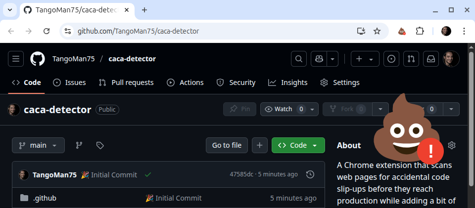
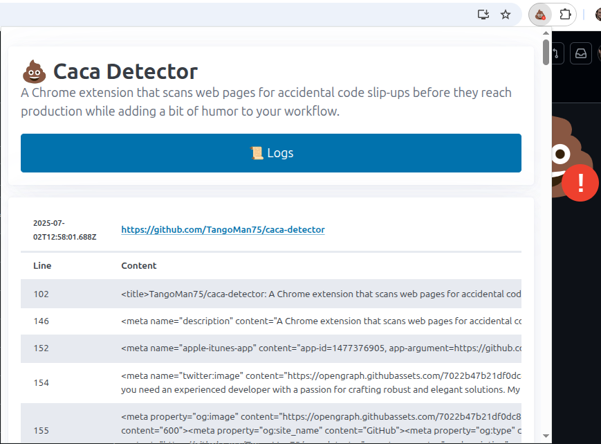
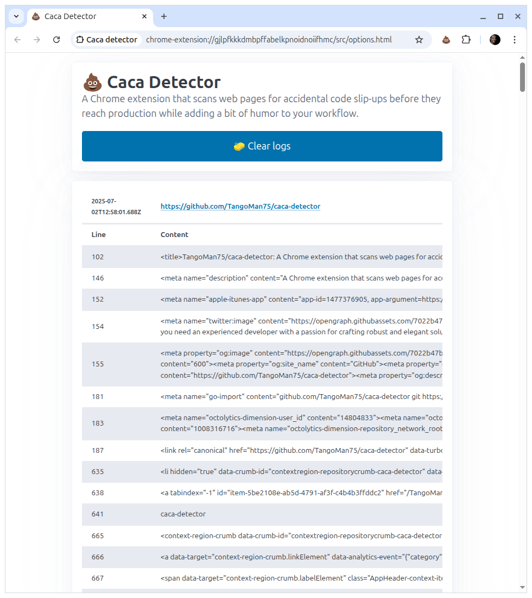

[](https://github.com/TangoMan75/caca-detector/releases)


[](https://github.com/TangoMan75/caca-detector/actions/workflows/chrome-extension.yml)


💩 Caca Detector - Catch the Code Slip-Ups Before Your Users Do
===============================================================


**Caca Detector** is a Chrome extension that displays a notification when it detects the word _"caca"_ on a web page.
A project inspired by a good friend of mine. 😉

</br>

🚀 Features
-----------

- 💩 Scans web pages for the word _"caca"_.
- 💩 Displays a _"pile of poo"_ emoji on the page and changes the extension icon when a match is found.
- 💩 Real-time alerts when _"caca"_ appears on any page.
- 💩 Great for teams that value clean, professional code.
- 💩 Guaranteed to cause at least one awkward chuckle.

🤔 Why "Caca Detector"?
-----------------------

Developers are human. And code is often frustrating.

And sometimes we leave behind little messages like _"here"_, _"test"_, or _"foobar"_ in the code instead of using the _"console.log()"_ function or debugging tools.

And, in moments of peak frustration, **"caca"**.

The problem is when we forget to remove those messages, and they end up in production. Which inevitably causes a rather embarrassing comedic effect. You wouldn't believe how often this happens !!!

This Chrome extension scans webpages for those accidental gems and gently notifies you when they've slipped into production. Whether you're a quality control crusader or just appreciate the comedy of human error, **Caca Detector** is here to save face (and maybe your job).

📦 Installation
---------------

1. Go to the [Caca Detector](https://chromewebstore.google.com/detail/caca-detector/bdignjhbkmhmekpkdgdhgjgegghpbcde) page on the Chrome Web Store.
2. Click on the `Add to Chrome` button.
3. Click on the `Add extension` button on the confirmation popup.

🛠️ Usage
--------

1. 🌐 Browse any web page.
2.  If the extension detects _"caca"_ anywhere on the page or in the code, the _"pile of poo"_ icon in the toolbar will display a red spot.
3. A _"pile of poo"_ emoji will appear on the page, click on it to make it go away.

4. You can also open the extension popup to see the log of detected _"caca"_ occurrences.

5. The extension will also log the occurrences in the <code>📜 Logs</code> panel, where you can clear all logs.


🛠️ Developpement
----------------

1. Clone this repository:

```bash
git clone https://github.com/TangoMan75/caca-detector.git
```

2. Go to Chrome [Extensions](chrome://extensions) panel.
3. Enable `Developer mode`
4. Click `Load unpacked` button and select **Caca Detector** extension folder.
5. You need to have [Node.js](https://nodejs.org/) installed.
6. Then, run the following commands in the terminal to install dependencies:

```bash
yarn install
```

7. Run unit tests to ensure everything is working correctly:

```bash
yarn test
```

✅ How to test ?
----------------

1. Visit https://github.com/TangoMan75/caca-detector
2. A _"pile of poo"_ emoji should appear on the page.
3. The _"pile of poo"_ icon in the toolbar should display a red spot.
4. Click on the _"pile of poo"_ emoji to make it disapear.

🤝 Contributing
---------------

Thank you for your interrest in contributing to **Caca Detector**.

Please review the [code of conduct](./CODE_OF_CONDUCT.md) and [contribution guidelines](./CONTRIBUTING.md) before starting to work on any features.

If you want to open an issue, please check first if it was not [reported already](https://github.com/TangoMan75/caca-detector/issues) before creating a new one.

📜 License
----------

Copyrights (c) 2025 &quot;Matthias Morin&quot; &lt;mat@tangoman.io&gt;

[](LICENSE)
Distributed under the MIT license.

If you like **Caca Detector** please star, follow or tweet:

[](https://github.com/TangoMan75/caca-detector/stargazers)
[](https://github.com/TangoMan75)
[](https://twitter.com/intent/tweet?text=Wow:&url=https%3A%2F%2Fgithub.com%2FTangoMan75%2Fcaca-detector)

... And check my other cool projects.

👋 Let's Build Your Next Project Together !
-------------------------------------------

Clean code. Clear communication.

From first sketch to final launch, I've got your back.

[](https://tangoman.io)
